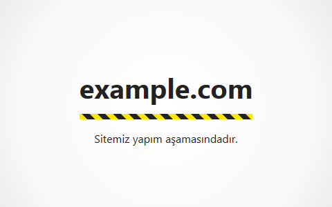

# Under Construction

A simple HTML document designed to be used as the temporary home page of a website.

## Usage

1. Edit `index.html` in order to change the title and the header.
2. Upload the file to the root directory of your website.

## License

Licensed under the [MIT License](https://opensource.org/licenses/MIT).
